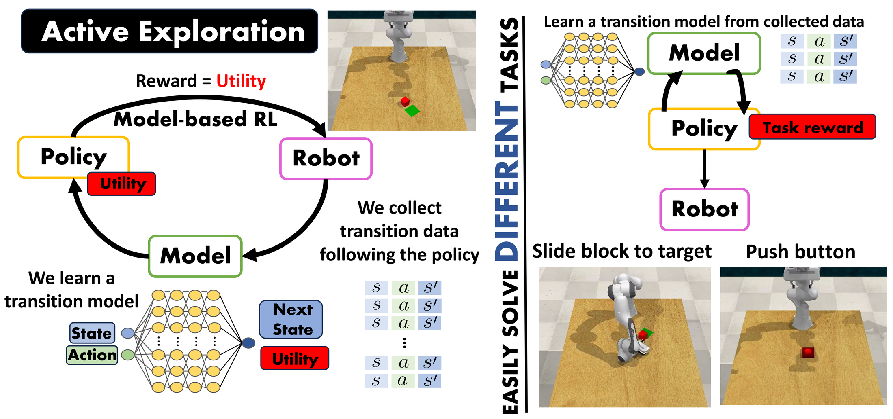

<h1 align="center">Active Exploration in Bayesian Model-based Reinforcement Learning for Robot Manipulation</h1>
<h3 align="center">ROBOT 2026</h3>

<div align="center">
  <a href="https://cplou99.github.io/web" target="_blank">Carlos Plou</a>,
  <a href="https://sites.google.com/unizar.es/anac" target="_blank">Ana C. Murillo</a>,
  <a href="https://webdiis.unizar.es/~rmcantin/" target="_blank">Ruben Martinez-Cantin</a>
</div>

<div align="center">
  DIIS-I3A, Universidad de Zaragoza, Spain
</div>

<div align="center">
  <a href="https://ropertunizar.github.io/BayesianActiveExploration/"><strong>🌍 Project page</strong></a> |
  <strong>📝 Paper (coming soon)</strong>
</div>

<p align="center">
  
</p>

---

## 🔔 News
- 🆕 10/2026: Code released.
- 🥳 10/2026: Paper accepted at ROBOT 2026.

---

## 📖 Description
In model-based RL, a dynamics model of the robot lets most policy learning happen in cheap simulated rollouts, and the same model can be reused across tasks. This repository explores **once**, task-agnostically, to learn that model as efficiently as possible:

- **Bayesian dynamics models.** We use the **Laplace approximation** (on a 1k-weight subnetwork, via [Laplace Redux](https://github.com/aleximmer/Laplace)) and **MC dropout**, and compare them with deep ensembles ([MAX](https://github.com/nnaisense/max)). They are as good as ensembles with ~3× less training time and up to 32× less memory, and the Laplace model is the best calibrated.
- **Active exploration.** An exploration policy is learnt with SAC *inside the model* to maximise the expected information gain of the next transition. Besides the Jensen–Rényi divergence used by MAX, we propose an **entropy metric**: the entropy of the moment-matched predictive Gaussian.
- **Robot manipulation.** We evaluate on HalfCheetah (MuJoCo) and on a **Franka Panda in CoppeliaSim/RLBench** controlled in joint velocities (push button, move block to target). Our methods match SAC trained for 200k steps per task with only 20k exploration steps shared by all tasks.

| Method | Dynamics model | Exploration utility | Mode |
|---|---|---|---|
| `LapMCEnt` (ours) | Laplace approximation, MC samples | Gaussian entropy | active |
| `LapMCRenyi` (ours) | Laplace approximation, MC samples | Jensen–Rényi divergence | active |
| `MCDropEnt` (ours) | MC dropout | Gaussian entropy | active |
| `MCDropRenyi` (ours) | MC dropout | Jensen–Rényi divergence | active |
| `MAX` | 32-member deep ensemble | Jensen–Rényi divergence | active |
| `EnsEnt` | 32-member deep ensemble | Gaussian entropy | active |
| `PERX` | 32-member deep ensemble | prediction error | reactive |
| `Random` | – | – | random actions |

## 🛠️ Requirements
The experiments were run with Python 3.8, PyTorch 1.12 (CUDA 11.3), gym 0.13 and laplace-torch.

```bash
conda env create -f environment.yml
conda activate bae
```

> **Note.** Install `laplace-torch` from the pinned GitHub commit in `environment.yml`. The PyPI release `0.1a2` fails when fitting the marginal likelihood of a subnetwork Laplace approximation.

**HalfCheetah** needs MuJoCo for `mujoco-py`. Follow the [mujoco-py instructions](https://github.com/openai/mujoco-py#install-mujoco) to install the binaries in `~/.mujoco`.

**Panda robot** needs CoppeliaSim 4.1, [PyRep](https://github.com/stepjam/PyRep) and [RLBench](https://github.com/stepjam/RLBench). We use RLBench's original `gym` interface, which was removed when RLBench moved to gymnasium, so install it from the last commit before that change:

```bash
# CoppeliaSim 4.1.0 (Ubuntu 20.04 shown; pick the build for your OS)
wget https://downloads.coppeliarobotics.com/V4_1_0/CoppeliaSim_Edu_V4_1_0_Ubuntu20_04.tar.xz
tar -xf CoppeliaSim_Edu_V4_1_0_Ubuntu20_04.tar.xz
export COPPELIASIM_ROOT=$PWD/CoppeliaSim_Edu_V4_1_0_Ubuntu20_04
export LD_LIBRARY_PATH=$LD_LIBRARY_PATH:$COPPELIASIM_ROOT
export QT_QPA_PLATFORM_PLUGIN_PATH=$COPPELIASIM_ROOT

pip install git+https://github.com/stepjam/PyRep.git
pip install git+https://github.com/stepjam/RLBench.git@f2c625fde9783702938de4e8df981a8f4941da26
```

## 🚀 Usage
Experiments are configured with [sacred](https://sacred.readthedocs.io). `python main.py print_config` lists every option, and any option can be overridden with `with key=value`.

**1. Explore.** Collect 20k transitions, check-pointing the buffer every 1k steps to `logs/<env>/<method>/<run>/`:
```bash
python main.py with method=LapMCEnt env_name=MagellanHalfCheetah-v2
python main.py with method=LapMCEnt env_name=CoppeliaRLBench-v2
```

**2. Evaluate.** For each saved buffer (every 2k steps by default), fit the model, learn a policy for every task inside it and execute it in the environment. Results go to `<run>/evaluation_<method>/performance_data.csv`, plus videos on the Panda robot:
```bash
python main.py with mode=evaluate method=LapMCEnt env_name=CoppeliaRLBench-v2 run_dir=logs/CoppeliaRLBench-v2/LapMCEnt/<run>
```

**3. Reproduce the figures.** Run several methods and seeds, then plot return against exploration steps:
```bash
python scripts/run_experiments.py --env CoppeliaRLBench-v2 --methods LapMCEnt MCDropRenyi MAX PERX --seeds 3
python scripts/plot_results.py --env CoppeliaRLBench-v2 --methods LapMCEnt MCDropRenyi MAX PERX
```

**4. Calibration and cost (Table I).** Train on the first 18k transitions of a run, test on the rest, and report AUSE, training and inference time:
```bash
python main.py calibration with method=LapMCEnt env_name=MagellanHalfCheetah-v2 run_dir=logs/MagellanHalfCheetah-v2/LapMCEnt/<run>
```

### Code structure
| File | Content |
|---|---|
| `main.py` | Exploration, evaluation and calibration experiments; method presets in `METHODS` |
| `models.py` | `EnsembleModel`, `MCDropoutModel`, `LaplaceModel` |
| `utilities.py` | Exploration utilities: Jensen–Rényi divergence, Gaussian entropy, prediction error |
| `imagination.py` | Imaginary MDP built from the dynamics model, where SAC learns the policies |
| `sac.py` | Soft Actor-Critic |
| `envs/` | HalfCheetah (running, flipping) and Panda/RLBench (push button, move block) with their task rewards |
| `calibration.py` | AUSE metric |
| `scripts/` | Batch runs and plots |
| `docs/` | Project page |

## 📜 License
This project is released under the [GNU AGPL v3](LICENSE.txt). The exploration pipeline (SAC, imagination MDP, buffer, normaliser, Jensen–Rényi utility, HalfCheetah tasks) is adapted from [MAX](https://github.com/nnaisense/max) by NNAISENSE.

## 📝 Citation
```bibtex
@inproceedings{plou2026activeexploration,
  title={Active Exploration in Bayesian Model-based Reinforcement Learning for Robot Manipulation},
  author={Plou, Carlos and Murillo, Ana C. and Martinez-Cantin, Ruben},
  booktitle={ROBOT 2026},
  year={2026}
}
```

## 🙏 Acknowledgements
This work was supported by a DGA scholarship, DGA project T45_23R, and by grants PID2024-159284NB-I00 and PID2024-158322OB-I00 funded by MCIN/AEI/10.13039/501100011033 and ERDF. We thank the authors of [MAX](https://github.com/nnaisense/max), [Laplace Redux](https://github.com/aleximmer/Laplace) and [RLBench](https://github.com/stepjam/RLBench) for releasing their code.
